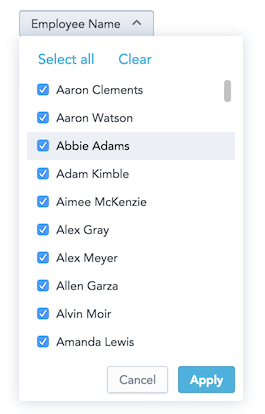

This is a dropdown component that lists attribute values. You can pass a callback function, which will receive a list of selected values, when a user hits "Apply".



## Example

In the following example, we list attribute values and fire the ```onApply``` callback function, when the selection is confirmed by the Apply button.

<!-- code from Examples: https://github.com/gooddata/gooddata-react-components/blob/master/examples/src/components/AttributeFilterExample.jsx -->
```javascript
import React, { Component } from 'react';
import { AttributeFilter } from '@gooddata/react-components';

import '@gooddata/react-components/styles/css/main.css';

import { employeeNameIdentifier, projectId } from '../utils/fixtures';

export class AttributeFilterExample extends Component {
    onApply(params) {
        // eslint-disable-next-line no-console
        console.log('AttributeFilterExample onApply', ...params);
    }

    render() {
        return (
            <div>
                <AttributeFilter
                    identifier={employeeNameIdentifier}
                    projectId={projectId}
                    onApply={this.onApply}
                />
            </div>
        );
    }
}
```
