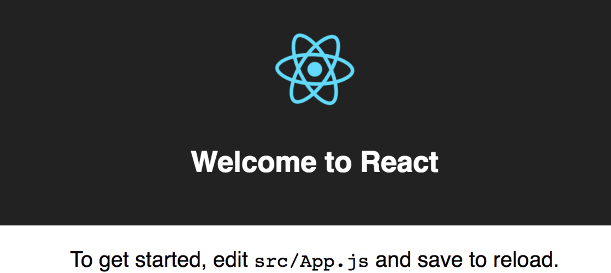
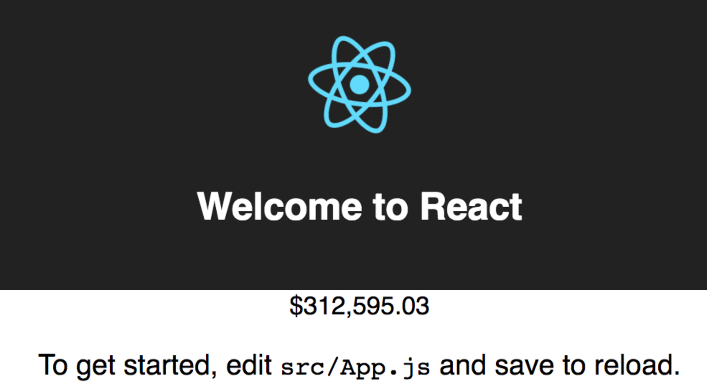

This tutorial will guide you through the process of creating your first analytical application using GoodData.UI with the Facebook’s `create-react-app` tool.

After you complete this tutorial, you will be able to display various measures and charts from your GoodData project within the context of your React application.

## Step 1 - Get create-react-app
Run the following command from the command line:
```bash
yarn global add create-react-app
```
This command installs the `create-react-app` tool that will help you create a functional skeleton of a React application.

## Step 2 - Create your React application
1. Run the following command from the command line:
    ```bash
    create-react-app my-first-app
    ```
    This command creates a directory named `my-first-app` with a functional skeleton of a React application. You can see the command output that looks something like the following:
    ```bash
    Success! Created my-first-app at /Users/user-name/dev/my-first-app
    ```

2. Change your current working directory to `my-first-app` (for example, by running `cd my-first-app` on Mac or Linux).

3. **GoodData.UI requires React 15.6.2**. However, the current version of `create-react-app` installs React 16. Downgrade your version of React to 15.6.2 by running the following command:
    ```bash
    yarn install
    yarn upgrade react@15.6.2 react-dom@15.6.2
    ```

## Step 3 - Add GoodData SDK dependencies
Run the following command from the command line:
```bash
yarn add @gooddata/react-components
```
This command adds the latest `@gooddata/react-components` to the list of your project dependencies in `package.json` and downloads all required packages.


## Step 4 - Start the development server

To set up a proxy, add the following section to the root level of your `package.json` \(this works with any application started using `react-scripts start`\):

```javascript
"proxy": {
  "/gdc": {
    "changeOrigin": true,
    "cookieDomainRewrite": "localhost",
    "secure": false,
    "target": "https://secure.gooddata.com/".
    "headers": {
      "host": "secure.gooddata.com",
      "origin": null
    }
  },
  "/*.html": {
    "changeOrigin": true,
    "secure": false,
    "target": "https://secure.gooddata.com/"
  }
},
```

Then start the server with the following command from the command line:

* If you are on Mac or Linux:
    ```bash
    HTTPS=true yarn start
    ```
* If you are on Windows:
    ```bash
    set HTTPS=true&&npm start
    ```

**Always** run your local development server using HTTP**S** because the GoodData API responses set cookies with the `secure` flag. Specifically, it means that if you skip the `HTTPS=true` part, you will not be able to log in.


## Step 5 - Establish a session
Open [https://localhost:3000/account.html](https://localhost:3000/account.html) in your browser, and enter your GoodData credentials. You are now logged in to GoodData.

If you see a warning about an insecure connection due to using a self-signed certificate, accept the exception: you can trust your localhost.

For the purpose of this tutorial, you are asked to establish a client session by simply logging in to GoodData.

In your production environment, your end users may be authenticated using [single sign-on](sso.md).


## Step 6 - Add GoodData components
Open [https://localhost:3000/](https://localhost:3000/) in your browser.
The default page generated by the create-react-app tool is displayed and it will look like the following example:



Now you can start adding your first GoodData component:
1. Open `src/App.js` in a text editor.
2. Add the following line to the other `import`s at the beginning of the `App.js` file:
    ```javascript
    import { Kpi } from '@gooddata/react-components';
    ```
3. Add the following line to the other `import`s at the beginning of the `App.js` file to load CSS:
    ```javascript
    import '@gooddata/react-components/styles/css/main.css';
    ```
4. Add simple KPI number by appending the following lines in the `render()` method:
    ```javascript
    <Kpi
      projectId="la84vcyhrq8jwbu4wpipw66q2sqeb923"
      measure="atSHqCtAePe4" />
    ```
    > Use project ID and measure ID from your project or use [live examples](https://gooddata-examples.herokuapp.com/).

**Save the changes.** The content of your `App.js` file should now look something like the following example:

```javascript
import React, { Component } from 'react';
import { Kpi } from '@gooddata/react-components';
import '@gooddata/react-components/styles/css/main.css';

import logo from './logo.svg';
import './App.css';
class App extends Component {
   render() {
      return (
         <div className="App">
            <div className="App-header">
               
               <h2>Welcome to React</h2>
            </div>
            <Kpi
               projectId="la84vcyhrq8jwbu4wpipw66q2sqeb923"
               measure="atSHqCtAePe4" />
            <p className="App-intro">
               To get started, edit <code>src/App.js</code> and save to reload.
            </p>
         </div>
      );
   }
}

export default App;
```

Return to your browser window. The default page now looks like the following:



Notice the KPI number that you have added.


## Step 7 - Keep your code clean
GoodData.UI provides a tool named [gdc-catalog-export](gdc-catalog-export.md) that can help you keep the list of object identifiers organized in a Javascript file within your application.

For example, see the following component used in this tutorial:

```javascript
<Kpi
   projectId="la84vcyhrq8jwbu4wpipw66q2sqeb923"
   measure="atSHqCtAePe4" />
```

In this component, `projectId="la84vcyhrq8jwbu4wpipw66q2sqeb923"` is a hardcoded reference to our project ID, and `measure="atSHqCtAePe4"` is a hardcoded reference to a measure.

With the [gdc-catalog-export](gdc-catalog-export.md) tool, you can save the list of all measures, attributes and other relevant objects to a JSON file.

To install the tool, run the following command from the command line:
```bash
yarn global add gdc-catalog-export
```

After you installed the tool, do the following:
1. Ensure that you are in the root folder of your app, run the following command, and fill the interactive prompts:
    ```bash
    $ gdc-catalog-export --output src/catalog.json
    ```
    The `src/catalog.json` file becomes a JSON file in your application.
    ```javascript
    {
      "measures": {
        "Avg Deal Size": {
          "identifier": "atSHqCtAePe4",
          "tags": ""
        },
    ...
    ```
2. Import the `catalog.json` file into your `App.js` file.
   You can now reference the measure using its human-readable alias \(`Avg Deal Size`\) instead of its identifier \(`atSHqCtAePe4`\). Your new `App.js` file would look like the following:
    ```javascript
    import React, { Component } from 'react';
    import { Kpi } from '@gooddata/react-components';
    import '@gooddata/react-components/styles/css/main.css';

    import logo from './logo.svg';
    import './App.css';

    import { CatalogHelper } from '@gooddata/react-components';
    import catalogJson from './catalog.json';
    const C = new CatalogHelper(catalogJson);

    class App extends Component {
       render() {
          return (
             <div className="App">
                <div className="App-header">
                   
                   <h2>Welcome to React</h2>
                </div>
                <Kpi
                   projectId="la84vcyhrq8jwbu4wpipw66q2sqeb923"
                   measure={C.measure('Avg Deal Size')} />
                <p className="App-intro">
                   To get started, edit <code>src/App.js</code> and save to reload.
                </p>
             </div>
          );
       }
    }

    export default App;
    ```
Notice that the code in the `App.js` file still includes the hardcoded reference to the project \(`la84vcyhrq8jwbu4wpipw66q2sqeb923` on line 17\). In your real application, you may prefer to pass the project ID via URL or a hash parameter, or it may be retrieved from your server-side APIs \(if you are integrating GoodData into an existing application\). It depends on your application's architecture.

## Next steps

Here are some suggestions about what you can do after you created your first visualization:

* Add more different elements: tables, charts, custom visualizations. For more information, see [how to use visual components](start_with_visual_components.md).
* [Enable drilling](drillable_item.md).
* Authenticate your users [using Single Sign-on (SSO)](sso.md) rather than sending them to a proxied GoodData login page.
