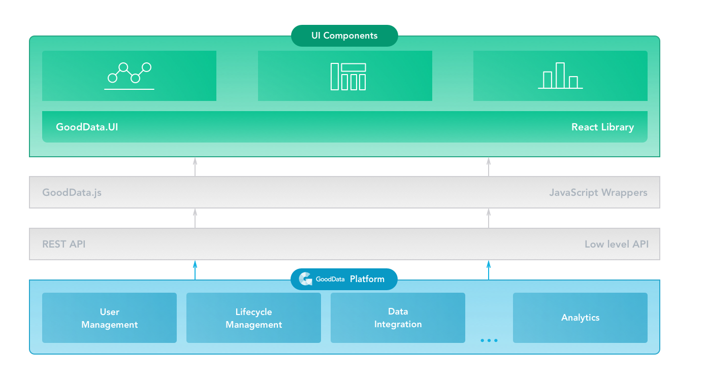

**GoodData Platform** is a powerful end-to-end analytics platform as a service with multi-tenant distribution that scales to hundreds of terabytes of data and hundreds of thousands of users. Learn more about the [GoodData platform](https://www.gooddata.com/platform) and how to [embed its analytics possibilities](https://www.gooddata.com/embedded-analytics).

## GoodData platform and GoodData.UI

* **GoodData REST API** is a low-level API that makes the platform features accessible to all GoodData users.

* **GoodData JS** is a set of JavaScript wrappers written on top of the *REST API*. Additionally, GoodData JS handles authentication, unified query request format (AFM), and many more.

* **GoodData.UI** is a React-based JavaScript library for building responsive analytical applications. This library is written on top of *GoodData JS* and makes creating analytical applications even more convenient by adding visual components.

## Main concepts

Imagine you are an account manager for a Franchise network. You want to know the **average** daily amount of money for each Franchise office in the USA.

You have the data that shows how much money all your Franchises earn daily. Let's display this data as a column chart:

The graph shows the elements that together work as unified input for creating a **visualization** using GoodData.UI, which is a view into a specific part of your data. In the column chart:

* `$ Avg Daily Total Sales` is a **measure** that is a computational expression that aggregates one or more numerical values. In this example, you are interested in the average daily amount.

* `Location State` is an **attribute** that breaks the measure apart and provides context to the data. In this example, the measure is sliced by the location of the Franchise offices.

* A **filter** is a set of conditions that removes specific values from your original data. Notice that the chart shows only USA-specific values of `Location State`. This is because the column chart has a **filter** applied to display only the offices located in the USA. A filter is a set of characteristics applied to a visualization (or measure) to remove values from computed and displayed values.